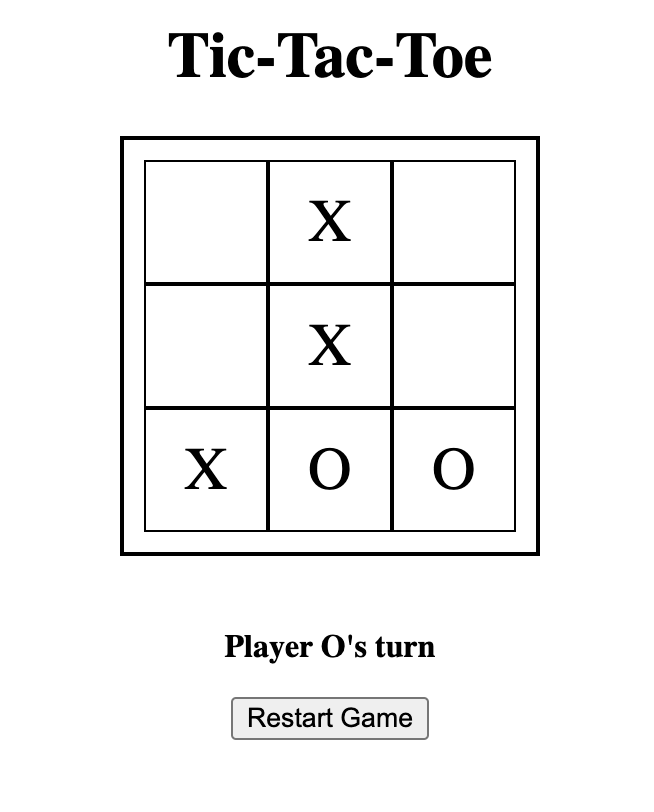

# Tic-Tac-Toe Game

A simple Tic-Tac-Toe game implemented with both front-end and back-end components. This game allows two players to take turns marking their symbols (X and O) on a 3x3 grid. The first player to get three of their symbols in a row, column, or diagonal wins the game. If all the cells are filled without a winner, the game is declared a draw.

## Features

- Play against another player locally.
- Real-time updates on the game status.
- Clear the board and start a new game.

## Technologies Used

- Front-end: HTML, CSS, JavaScript
- Back-end: Node.js with Express.js

## Installation

1. Clone this repository to your local machine.
2. Ensure you have Node.js installed.
3. Open a terminal and navigate to the project's directory.
4. Run the following command to install the necessary dependencies: npm install
5. Start the server by running the following command: node server.js
6. Open your web browser and visit `http://localhost:3000` to play the game.

## How to Play

1. Open the game in your web browser.
2. Two players take turns by clicking on an empty cell on the game board.
3. The first player is assigned the symbol X, and the second player is assigned the symbol O.
4. The game will display the current player's turn and the game status.
5. The first player to get three of their symbols in a row, column, or diagonal wins the game.
6. If all cells are filled and no winner is determined, the game is declared a draw.
7. To start a new game, click the "Restart" button.

